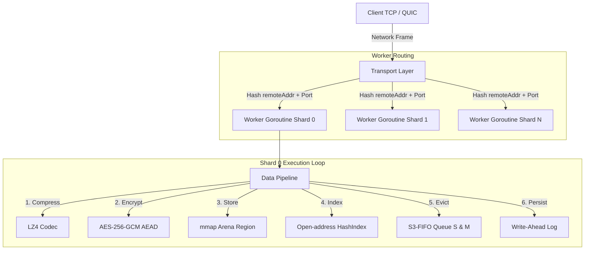
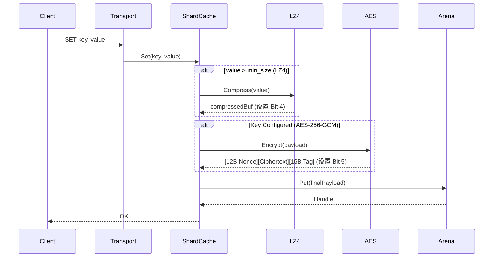

# Horreum 架构与设计规范 🏛️

[English](ARCHITECTURE.md) | [Русский](ARCHITECTURE.ru.md) | [中文](ARCHITECTURE.zh.md)

---

## 1. 系统总体架构

Horreum 采用 **无共享分片架构（Shared-Nothing Sharded Architecture）** 设计。客户端网络流量（TCP 数据帧或 QUIC 数据流）将被确定性地路由至专用的 Worker Goroutine，每个 Worker 独占管理一个独立的缓存分片（`shardCache`）。这种设计完全消除了多线程在索引查找与 Arena 内存分配时的互斥锁竞争。



---

## 2. 内存与 Arena 管理 (`internal/arena`)

### Mmap 内存布局

系统通过 `unix.Mmap`（Linux 下使用 `MAP_ANON | MAP_PRIVATE`）直接向操作系统内核申请大块连续内存区域（例如 256 MiB 或 1 GiB）。

数据通过 **Bump Allocator（碰撞分配器）** 线性写入。当对象因淘汰被释放时，其偏移量将被添加至按大小分类（64B, 128B, 256B, ..., 1MB）的 **Segregated Freelist（隔离空闲列表）** 中，以防止内存外部碎片化。

```
+-------------------------------------------------------------------------+
| Superblock (64B) | Object 0 | Object 1 | Object 2 | ... | Free Region  |
+-------------------------------------------------------------------------+
```

### 零内存分配句柄 (`Handle`)

Arena 不会返回堆分配的 Go 字节切片（`[]byte`），而是返回轻量级的 12 字节句柄：

```go
type Handle struct {
    Offset uint32 // mmap 区域中的字节偏移量
    Size   uint32 // 对象载荷长度
    Region uint16 // 区域 ID
    Meta   uint16 // 频率计数器 (Bit 0-1), 队列标签 (Bit 2-3), 压缩标记 (Bit 4), 加密标记 (Bit 5)
}
```

应用通过 `unsafe.Slice` + `unsafe.Add` 直接读取 mmap 内存，实现在读取时的零 GC 分配。

---

## 3. 数据处理流水线



---

## 4. 淘汰策略 (`internal/eviction`)

Horreum 实现了 **S3-FIFO**（Simple, Scalable, Static FIFO）淘汰算法：
- **Small Queue (S)**：占总容量 10%，新数据优先进入该队列。
- **Main Queue (M)**：占总容量 90%，高频访问的数据转移至该队列。
- **Ghost Index**：4 字节指纹哈希索引，记录已淘汰键。若 Ghost 中的键被重新插入，将直接进入 M 队列。

---

## 5. 持久化与恢复 (`internal/arena/persist`)

### 预写日志 (WAL)
每次变更操作（`SET`, `DEL`）均会向 `wal.log` 追加一条二进制记录。

### 检查点与冷启动
- 在正常关闭或定期检查点期间，内存中的 `HashIndex` 被快照保存至磁盘，WAL 被清空（`Rotate()`）。
- 在冷启动时，Horreum 加载 `arena.dat`，从检查点恢复 `HashIndex`，并重放未保存的 WAL 记录。
