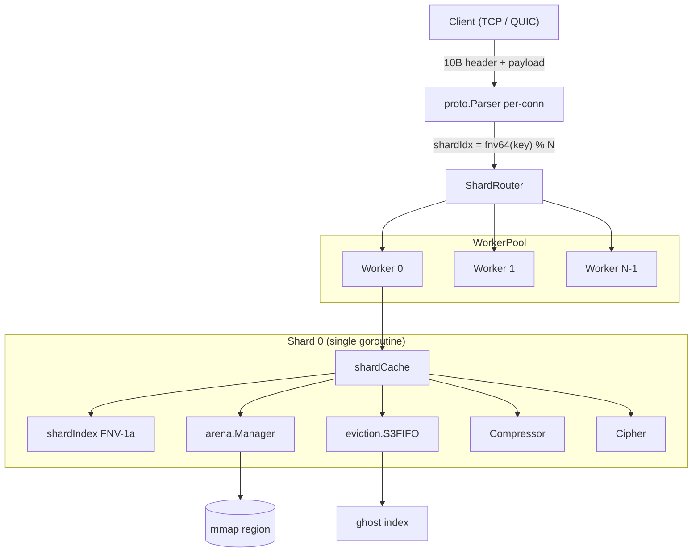
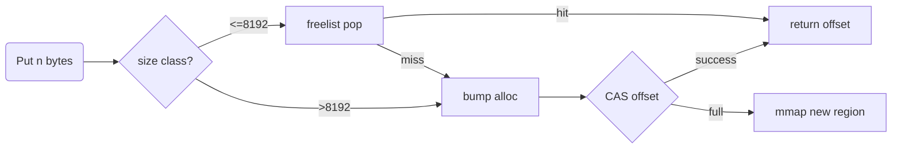
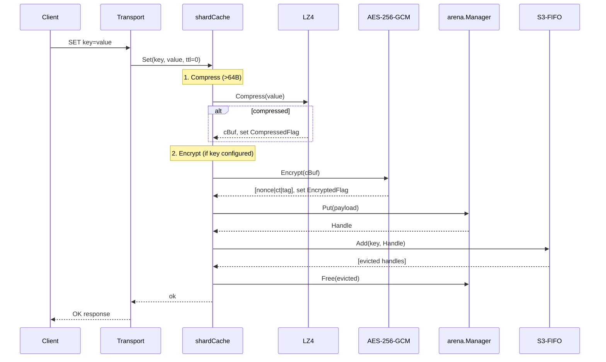

# Horreum Architecture & Design Specification 🏛️

[English](architecture.md) | [Русский](ru/architecture.md) | [中文](zh/architecture.md)

---

## 1. System High-Level Architecture

Horreum is a shared-nothing sharded in-memory key-value cache with optional durability, optional authenticated encryption, and optional value compression. Every architectural decision flows from one invariant:

> **The hot path must never allocate on the Go heap.**

Every cache value lives in a memory-mapped region owned by Go via `unsafe.Slice`. Each shard is touched by exactly one goroutine (the *shard worker*). The transport layer forwards all operations for a given key to the goroutine that owns the shard where `fnv64(key) mod NumShards` lands.



### 1.1 Principles

| # | Principle | Why it matters |
|---|-----------|----------------|
| 1 | **Zero-alloc hot path** | No GC pauses on the data path; predictable p99 latency. |
| 2 | **Shared-nothing shards** | No locks on `Get`/`Set`; cache hits are pure in-memory. |
| 3 | **Lock-free atomic frequency counters** | S3-FIFO `Touch` never blocks. |
| 4 | **Pure mmap storage** | Values live outside the Go heap; the GC never scans them. |
| 5 | **Connection-pinned routing** | Predictable per-shard queue depth, no per-key hashing on dispatch. |
| 6 | **Append-only WAL** | Crash recovery is a forward replay; no inverse scans. |
| 7 | **Stdlib only** (except quic-go) | Static binary, no transitive supply-chain surface. |

---

## 2. Memory & Arena Management (`internal/arena`)

### 2.1 Why `mmap`?

When a Go slice points at `mmap`'d memory, the runtime cannot trace or relocate it. This means:

- **`make([]byte, …)` and `append` are prohibited** — they may trigger GC scans.
- **`copy(dst[off:off+n], src)` is the only allowed mutation primitive** — `dst` is the mmap slice, `src` is the caller-provided buffer.
- **`unsafe.Slice((*byte)(base), size)`** constructs a view into mmap without allocation.

### 2.2 Region Layout

Each `arena.Manager` owns one or more *regions* (default 256 MiB). The first region of a file-backed arena reserves a 4 KiB superblock + a checkpoint region (capped at 1 MiB, capped at half the region size).

```
+---------------------------------------------------------------------+
| Superblock (4 KiB)  |  Checkpoint (up to regionSize/8, max 1 MiB)  |  reserved prefix
+---------------------------------------------------------------------+
| Object 0 (aligned to 8B) | Object 1 | Object 2 | ... | Free Region |  user allocations
+---------------------------------------------------------------------+
```

Anonymous arenas (`NewManager`) skip the reservation. File-backed arenas (`OpenFileManager`) reserve it via `allocator.Skip(n)` so subsequent `Put` handles never collide with the persist prefix.

### 2.3 Handle — A 12-byte Pointer-Less Reference

```go
type Handle struct {
    Offset uint32 // 8-byte aligned offset within region
    Size   uint32 // payload length
    Meta   uint16 // eviction freq + queue tag + compressed/encrypted flags
    Region uint8  // region id
    _      [1]byte
}
```

Because `Handle` carries no pointers, it is invisible to the garbage collector. Storing thousands of handles in a hash index causes zero GC pressure.

### 2.4 Meta Bits

```go
bits 0-1:  freq       (0..3, atomic via arena.Manager)
bits 2-3:  queue tag  (0=none, 1=S, 2=M)
bit 4:     compressed (LZ4 applied)
bit 5:     encrypted  (AES-256-GCM applied)
bits 6-15: reserved
```

`arena.Manager` exposes `IncFreq`, `GetFreq`, `SetFreq`, `GetMeta`, `SetMeta`, `CASMeta`, `OrMetaBits`, `ClearMetaBits` — all lock-free atomics against `region.meta[offset/alignBytes]`.

### 2.5 Bump + Segregated Freelist

Per-region allocator keeps:

- `offset atomic.Uint64` — lock-free bump via CAS.
- `mu sync.Mutex` — serializes freelist pop/push.
- `fl [12]*freeNode` — segregated freelists for size classes 8, 16, 32, 64, 128, 256, 512, 1024, 2048, 4096, 8192 bytes. Class 11 (> 8 KiB) is *bump only*; freed large blocks remain as dead bump space.



### 2.6 Multi-Region Manager

`Manager` holds:

- `regions atomic.Pointer[[]*region]` — immutable snapshot taken via atomic load.
- `current *region` + `currentIdx atomic.Uint32` — fast path for "where to allocate next".
- `mu sync.Mutex` — held only on `newRegion` and `Close`.

`Put` takes the fast path (atomic load of `current` + CAS bump). On full it falls through to `putSlow`, which takes `mu`, allocates a new region (up to 256), and atomically swaps the `regions` slice.

---

## 3. Wire Protocol (`internal/proto`)

### 3.1 Frame Format

```
 0                   1                   2                   3
 0 1 2 3 4 5 6 7 8 9 0 1 2 3 4 5 6 7 8 9 0 1 2 3 4 5 6 7 8 9 0 1
+-+-+-+-+-+-+-+-+-+-+-+-+-+-+-+-+-+-+-+-+-+-+-+-+-+-+-+-+-+-+-+-+
|          Magic (0x4848)       |   OpCode (1B) |  Flags (1B)  |
+-+-+-+-+-+-+-+-+-+-+-+-+-+-+-+-+-+-+-+-+-+-+-+-+-+-+-+-+-+-+-+-+
|       KeyLength (2 Bytes)     |     ValueLength (4 Bytes)     |
+-+-+-+-+-+-+-+-+-+-+-+-+-+-+-+-+-+-+-+-+-+-+-+-+-+-+-+-+-+-+-+-+
|                  ... Key Bytes ... (KeyLength bytes)           |
+-+-+-+-+-+-+-+-+-+-+-+-+-+-+-+-+-+-+-+-+-+-+-+-+-+-+-+-+-+-+-+-+
|                 ... Value Bytes ... (ValueLength bytes)        |
+-+-+-+-+-+-+-+-+-+-+-+-+-+-+-+-+-+-+-+-+-+-+-+-+-+-+-+-+-+-+-+-+
```

- **Little-endian**, **10-byte header**, max frame 64 MiB.
- Magic `0x4848` (`"HH"`) rejects foreign traffic.
- `Frame.Key` and `Frame.Value` are zero-copy views into the input buffer; the caller MUST keep the buffer alive until the frame is consumed.

### 3.2 Opcode Table

| Code | Name          | Notes |
|------|---------------|-------|
| 0x01 | GET           | key-only |
| 0x02 | SET           | key+value |
| 0x03 | DEL           | key-only |
| 0x04 | SETEX         | key + `[ttl:4][value]` |
| 0x05 | CAS           | key + `[expLen:4][expected][new]` |
| 0x06 | INCR          | key + `[delta:8]` |
| 0x07 | SCAN          | key (prefix) + `[cursor:8][count:4]` |
| 0x08 | DELPREFIX     | key (prefix) only |
| 0x09 | HSET          | hash set |
| 0x0A | HGET          | hash get |
| 0x0B | HDEL          | hash delete |
| 0x0C | HGETALL       | hash get-all |
| 0x0D | LPUSH         | list push left |
| 0x0E | LPOP          | list pop left |
| 0x0F | RPUSH         | list push right |
| 0x10 | RPOP          | list pop right |
| 0x11 | LLEN          | list length |
| 0x12 | SADD          | set add |
| 0x13 | SREM          | set remove |
| 0x14 | SISMEMBER     | set is-member |
| 0x15 | SMEMBERS      | set all members |

Responses set `flags=0` on success, `flags=1` on error.

### 3.3 Streaming Parser

`Parser.Feed(buf)` appends `buf` to pending bytes and extracts complete frames. Incomplete bytes are retained for the next call. On error (`ErrBadMagic`, `ErrFrameTooLarge`) the parser is invalidated until `Reset`.

---

## 4. Transport Layer

### 4.1 Shared-Nothing Shard Workers

```
                    WorkerPool
+-------------------------------------------------------+
| [worker 0: chan job, single goroutine]                |
| [worker 1: chan job, single goroutine]                |
| ...                                                   |
| [worker N-1: chan job, single goroutine]             |
+-------------------------------------------------------+

WorkerPool.Submit(job, shardIdx) → worker[shardIdx].queue ← job
```

Each connection (TCP) or stream (QUIC) submits its parsed frame as a `Job` to the worker whose index matches `fnv64(key) % NumShards`. The worker drains its queue serially.

### 4.2 Routing Strategies

| Mode | Routing rule | Why |
|------|--------------|-----|
| Default (single-key ops) | `fnv64(key) % NumShards` | Per-key locality. |
| Connection-pinned (TCP) | `fnv64(remoteAddr) % NumShards` | Per-connection locality. |
| SCAN / DELPREFIX | iterate all shards | Cross-shard operation. |

`HandleFrame` rechecks `router.CacheIndexFor(fr.Key) == workerIdx` before dispatch.

### 4.3 TCP Transport (`internal/transport/tcp`)

- Accept loop on `net.Listen("tcp", addr)`.
- Each accepted connection owns a `proto.Parser` and a per-connection write buffer.
- Submit every parsed frame as a `Job`.
- Backpressure is bounded by the worker's buffered channel (`queueDepth = 4096` default).
- Errors per-connection are throttled via `logger.NetErrorLimiter` (5 tokens/sec, burst 10).

### 4.4 QUIC Transport (`internal/transport/quic`)

- Uses `quic-go` for TLS 1.3 + multiplexed streams.
- Certificate registered via `quic.RegisterCertificate`.
- One stream per request.

---

## 5. Data Processing Pipeline



### 5.1 Compression (`internal/compress`)

- Pure-Go LZ4 block encoder/decoder (no CGO).
- Min size 64 bytes; smaller values are left uncompressed.
- ~2 GB/s decompress throughput for 1 MiB payloads.

### 5.2 Encryption (`internal/encrypt`)

- AES-256-GCM AEAD; 12-byte random nonce per value; 16-byte authentication tag.
- Wire format: `[nonce | ciphertext | tag]` — total overhead 28 bytes.
- Key source: file path or `HORREUM_KEY` env var (hex / base64 / raw).

### 5.3 Invariant: Compress-then-Encrypt

Encryption adds pseudorandom entropy that defeats compression. Always compress before encrypt. `Handle.Meta` carries both flags so `Get` knows the order.

### 5.4 Eviction (`internal/eviction`)

**S3-FIFO** segregates objects into:

- **S (Small)** — 10% of capacity. New keys land here.
- **M (Main)** — 90% of capacity. Frequently-accessed keys migrate here.
- **G (Ghost)** — same size as M. Stores 4-byte fingerprints of keys evicted from S.

`Touch` is **lock-free** (only atomic reads/writes). `Add`, `Delete`, `Remove` take `mu`.

---

## 6. Persistence & Recovery (`internal/arena/persist`)

### 6.1 Disk Layout

```
/var/lib/horreum/
├── arena.dat          ← MAP_SHARED memory-mapped region
└── wal.log            ← append-only WAL
```

### 6.2 Superblock (v1)

56-byte logical record stored at byte 0:

| Offset | Size | Field |
|--------|------|-------|
| 0 | 8 | magic `"HORREUM\0"` |
| 8 | 4 | version (1) |
| 12 | 8 | regionSize |
| 20 | 8 | indexOffset (always 4096) |
| 28 | 8 | indexLen |
| 36 | 8 | walOffset (post-checkpoint) |
| 44 | 4 | flags (bit 0 = durable) |
| 48 | 8 | checkpointCount |

### 6.3 WAL Record Format

```
SET/SETEX (20/24 bytes):
  magic "WAL\0" (4) | op (1) | keyLen (2) | valLen (4) | hOff (4) | hSize (4) | hReg (1) | key | value

DEL (12 bytes):
  magic "WAL\0" (4) | op (1) | keyLen (2) | valLen=0 (4) | key
```

### 6.4 Cold Start

1. Open `arena.dat` via `mmap(MAP_SHARED)`. If new, write a fresh superblock.
2. Open `wal.log` via `os.OpenFile(O_RDWR|O_CREATE)`. Run `repairTail` to truncate any partial record.
3. Load checkpoint if present, else start empty.
4. Replay the WAL from byte 0.
5. Refresh `arena.Manager.liveObjs` and bump pointer.

### 6.5 Checkpoint

1. `index.HashIndex.Snapshot()` — list of live entries.
2. Encode into the arena's reserved checkpoint region.
3. `mgr.Sync()` (flush body).
4. Update superblock (`indexLen`, `walOffset = 0`).
5. `mgr.Sync()` (flush superblock).
6. `wal.Rotate()` (truncate `wal.log`).

### 6.6 Background Sync

In persistent mode, a `time.Ticker` (default 1 second) calls `SyncAsync()` which schedules `MS_ASYNC` on the arena.

---

## 7. Configuration & Startup (`internal/config`)

### 7.1 YAML Schema

```yaml
server:
  addr: ":7373"
  transport: "tcp"
  shards: 4
  region_size: "256MiB"
  evict_capacity: 4096
  tls_cert: ""
  tls_key: ""
  shutdown_timeout: "30s"
storage:
  persistent_path: ""
  durable: true
metrics:
  addr: ":9090"
compression:
  algorithm: "none"
  min_size: 64
logging:
  level: "info"
  format: "text"
  slow_log_threshold: "10ms"
security:
  encryption_key_path: ""
```

### 7.2 CLI Flags

```
horreum --config=config.yaml
horreum --addr=:7373 --transport=tcp
horreum --persistent-path=/var/lib/horreum --durable=true
horreum --encryption-key-path=/etc/horreum.key --tls-cert=... --tls-key=...
horreum --keygen=/etc/horreum.key
horreum --version
```

### 7.3 Bootstrap Order (`cmd/horreum/main.go`)

1. Parse flags + YAML.
2. `logger.Init` (slog level + format + slow threshold).
3. Init compressor / cipher (auto-generate key file if missing).
4. Init metrics gauges + recorder.
5. Init storage (anonymous `ShardSet` or persistent `PersistentManager` + `ShardSet` + WAL replay).
6. Start metrics HTTP server.
7. Start transport server.
8. Wait for `SIGINT`/`SIGTERM`.
9. Shutdown coordinator: stop listener → drain → persist → close.

---

## 8. Observability

### 8.1 Prometheus Metrics

Exposed at `:9090/metrics`:

```
horreum_set_observations_total{status="ok"}
horreum_set_observations_total{status="err"}
horreum_set_latency_seconds_bucket{le="..."}
horreum_set_latency_seconds_sum
horreum_set_latency_seconds_count
```

Plus gauges: `horreum_memory_used_bytes`, `horreum_memory_free_bytes`, `horreum_index_keys_total`, `horreum_evictions_total{queue="S"|"M"}`.

### 8.2 Health Check

`GET /healthz` returns `200 OK`.

### 8.3 Logging

`slog` is configured at startup. WAL fsync operations exceeding `logging.slow_log_threshold` (default 10 ms) emit a `WARN` log line.

---

## 9. Performance Budget

| Op | Measured p99 | Driver |
|----|--------------|--------|
| `GET` (in-memory, ~4 KiB) | ~600 ns | FNV-1a + linear probe + `arena.View` |
| `SET` (in-memory, ~4 KiB, plain) | ~1.2 µs | `arena.Put` (CAS + copy) + `idx.put` |
| `SET` (compressed+encrypted) | ~6 µs | LZ4 + AES-GCM + arena alloc |
| `TOUCH` (S3-FIFO) | ~50 ns | Atomic `IncFreq` |

---

## 10. Failure Modes & Recovery

| Failure | Detection | Recovery |
|---------|-----------|----------|
| Process crash mid-Put | Lost in-flight WAL fsync | Cold start → load checkpoint → replay WAL. |
| Superblock corruption | Bad magic/version | Treat arena as fresh → full WAL replay. |
| Corruption mid-checkpoint | Partial body | `ErrCheckpointBadMagic` → full WAL replay. |
| Partial WAL record | `repairTail` walks past it | Truncate to last complete record. |
| OOM (arena full) | `arena.ErrArenaFull` | API error; no automatic spillover. |
| Bad AES key on read | `cipher.Open` returns `decryption failed` | API error; data unrecoverable. |

---

## 11. Extension Points

| Want to add… | Where to look |
|--------------|--------------|
| New opcode | `internal/proto/proto.go` + `internal/transport/handler.go` + `api.CacheService` |
| New compressor | Implement `compress.Compressor` (4 methods) |
| New cipher | Implement `encrypt.Cipher` (3 methods) |
| New eviction policy | Replace `internal/eviction`; keep `Touch` lock-free |
| Persistent checkpoint format | `internal/arena/persist/checkpoint.go` (bump magic + version) |
| New transport | Implement `api.Transport` factory + per-stream job dispatch |

See `AGENTS.md` "Adding a New Opcode" / "Adding a New Feature" for the checklist.
