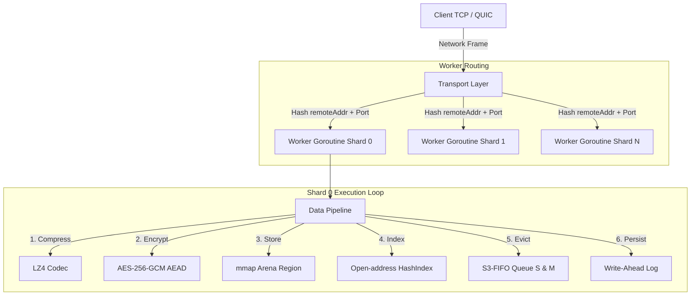
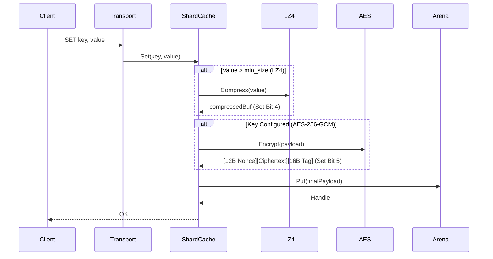

# Horreum Architecture & Design Specification 🏛️

[English](architecture.md) | [Русский](ru/architecture.md) | [中文](zh/architecture.md)

---

## 1. System High-Level Architecture

Horreum is built around a **shared-nothing sharded architecture**. Incoming client traffic (TCP frames or QUIC streams) is deterministically routed to a dedicated worker goroutine that exclusively owns a single cache shard (`shardCache`). This eliminates cross-thread mutex contention on index lookups and arena mutations.



---

## 2. Memory & Arena Management (`internal/arena`)

### Mmap Memory Layout

Memory is requested directly from the OS kernel via `unix.Mmap` (with `MAP_ANON | MAP_PRIVATE` on Linux) in large contiguous regions (e.g. 256 MiB or 1 GiB). 

Values are placed linearly via a **Bump Allocator**. When objects are freed via eviction, their offsets are added to a **Segregated Freelist** categorized by size classes (64B, 128B, 256B, ..., 1MB) to prevent external memory fragmentation.

```
+-------------------------------------------------------------------------+
| Superblock (64B) | Object 0 | Object 1 | Object 2 | ... | Free Region  |
+-------------------------------------------------------------------------+
```

### Zero-Copy Handles (`Handle`)

Instead of returning heap-allocated Go byte slices (`[]byte`), the arena returns lightweight 12-byte handles:

```go
type Handle struct {
    Offset uint32 // Byte offset in mmap region
    Size   uint32 // Object payload length
    Region uint16 // Region ID
    Meta   uint16 // Frequency counter (bits 0-1), Queue tag (bits 2-3), Compressed (bit 4), Encrypted (bit 5)
}
```

The application reads values directly from mmap using `unsafe.Slice` + `unsafe.Add`, achieving zero GC allocations on reads.

---

## 3. Data Processing Pipeline



### Encryption & Compression Invariants
- **Compress-then-Encrypt**: Compression is ALWAYS applied before encryption. Encrypted ciphertext exhibits maximum entropy and cannot be compressed.
- **Bit 4 (`CompressedFlag`)**: Indicates the stored buffer has a 4-byte little-endian original size header followed by LZ4 block payload.
- **Bit 5 (`EncryptedFlag`)**: Indicates the stored buffer has a 12-byte random IV followed by AES-256-GCM ciphertext and 16-byte authentication tag.

---

## 4. Eviction Policy (`internal/eviction`)

Horreum implements **S3-FIFO** (Simple, Scalable, Static FIFO), outperforming LRU under scan-heavy workloads:

- **Small Queue (S)**: 10% of capacity. New items land here first.
- **Main Queue (M)**: 90% of capacity. Items frequently accessed migrate here.
- **Ghost Index**: 4-byte fingerprint hash index tracking evicted keys. If a key in Ghost is re-inserted, it bypasses S and goes directly to M.

Touch operations mutate only atomic bitfields in `Handle.Meta` (`IncFreq`), ensuring zero lock contention on cache hits.

---

## 5. Persistence & Recovery (`internal/arena/persist`)

### Write-Ahead Log (WAL)
Every mutation (`SET`, `DEL`) appends a binary record to `wal.log`:

```
+---------------------------------------------------------------+
| Op (1B) | KeyLen (2B) | ValLen (4B) | Key Bytes | Value Bytes |
+---------------------------------------------------------------+
```

### Checkpointing & Cold Start
- During graceful shutdown or periodic checkpoints, the in-memory `HashIndex` is snapshot to disk, and the WAL is truncated (`Rotate()`).
- On cold start, Horreum loads `arena.dat`, restores `HashIndex` from the checkpoint, and replays any un-checkpointed WAL records.
