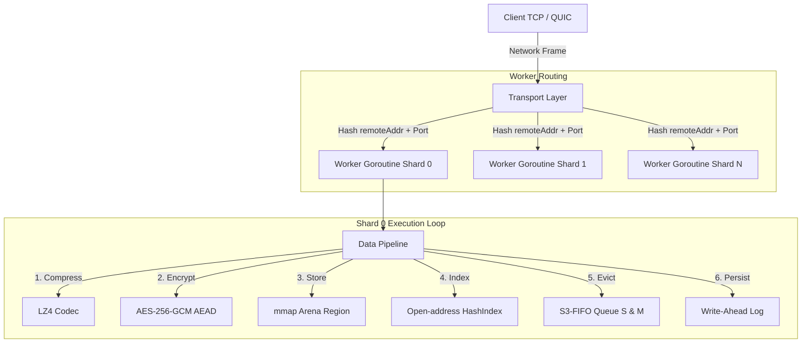
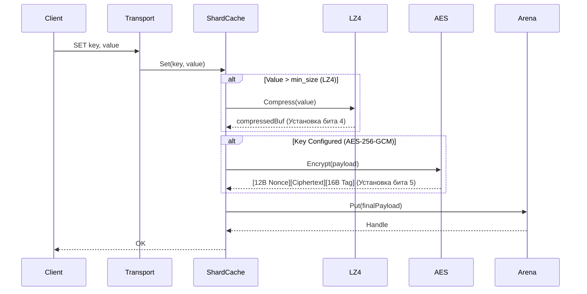

# Спецификация Архитектуры Horreum 🏛️

[English](../architecture.md) | [Русский](architecture.md) | [中文](../zh/architecture.md)

---

## 1. Общая Архитектура Системы

Horreum построен по принципу **Shared-Nothing (без совместного использования ресурсов)**. Входящий сетевой трафик (TCP-кадры или QUIC-стримы) детерминированно маршируется на отдельную горутину-воркер, которая монопольно владеет одним шардом кеша (`shardCache`). Это полностью исключает блокировки (mutex contention) между потоками при поиске по индексу и аллокации в арене.



---

## 2. Управление Памятью и Аренами (`internal/arena`)

### Mmap Структура Памяти

Память запрашивается напрямую у ядра ОС через `unix.Mmap` (`MAP_ANON | MAP_PRIVATE` на Linux) непрерывными регионами (например, 256 MiB или 1 GiB).

Новые объекты размещаются последовательно через **Bump Allocator**. При вытеснении объектов их смещения добавляются в **Segregated Freelist** (изолированные фрилисты), разделенные по классам размеров (64B, 128B, 256B, ..., 1MB) для предотвращения внешней фрагментации.

```
+-------------------------------------------------------------------------+
| Superblock (64B) | Object 0 | Object 1 | Object 2 | ... | Free Region  |
+-------------------------------------------------------------------------+
```

### Указатели Zero-Copy (`Handle`)

Вместо возврата выделенных в куче слайсов (`[]byte`), арена оперирует 12-байтными структурами `Handle`:

```go
type Handle struct {
    Offset uint32 // Смещение в регионе mmap
    Size   uint32 // Длина объекта в байтах
    Region uint16 // ID региона
    Meta   uint16 // Счетчик частоты (биты 0-1), Тег очереди (биты 2-3), Сжато (бит 4), Зашифровано (бит 5)
}
```

Чтение из mmap выполняется напрямую через `unsafe.Slice` + `unsafe.Add`, гарантируя нулевые аллокации в GC.

---

## 3. Пайплайн Обработки Данных



### Правила сжатия и шифрования:
- **Сначала сжатие, затем шифрование**: Компрессия ВСЕГДА применяется до шифрования, так как зашифрованный шифротекст обладает высокой энтропией и не сжимается.
- **Бит 4 (`CompressedFlag`)**: Указывает, что payload содержит 4-байтный префикс оригинального размера и LZ4 блок.
- **Бит 5 (`EncryptedFlag`)**: Указывает, что payload содержит 12-байтный случайный IV, AES-256-GCM шифротекст и 16-байтный тег аутентификации.

---

## 4. Политика Вытеснения (`internal/eviction`)

В Horreum реализован алгоритм **S3-FIFO** (Simple, Scalable, Static FIFO):
- **Small Queue (S)**: 10% емкости. Сюда попадают новые элементы.
- **Main Queue (M)**: 90% емкости. Сюда перемещаются элементы с высокой частотой обращений.
- **Ghost Index**: 4-байтный хеш-индекс вытесненных ключей. Если ключ из Ghost вставляется повторно, он сразу попадает в M.

---

## 5. Персистентность и Восстановление (`internal/arena/persist`)

### Write-Ahead Log (WAL)
Каждая операция изменения (`SET`, `DEL`) записывается в `wal.log`:

```
+---------------------------------------------------------------+
| Op (1B) | KeyLen (2B) | ValLen (4B) | Key Bytes | Value Bytes |
+---------------------------------------------------------------+
```

### Контрольные точки (Checkpoint)
- При штатной остановке или по расписанию индекс `HashIndex` сохраняется на диск, а WAL очищается (`Rotate()`).
- При холодном старте Horreum загружает `arena.dat`, восстанавливает `HashIndex` из контрольной точки и проигрывает оставшиеся записи WAL.
