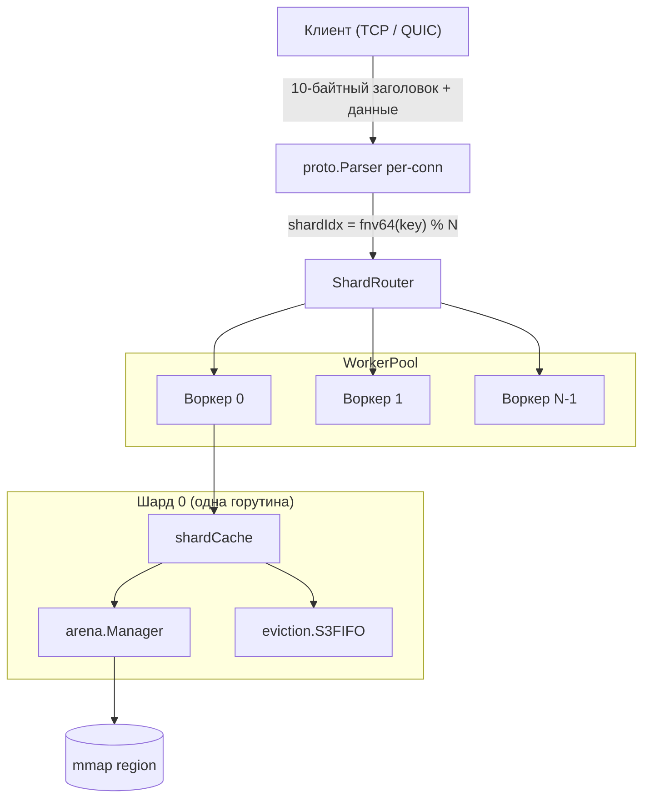
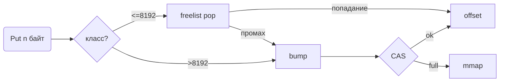

# Архитектура и спецификация дизайна Horreum 🏛️

[English](../architecture.md) | [Русский](architecture.md) | [中文](../zh/architecture.md)

---

## 1. Архитектура верхнего уровня

Horreum — сегментированный (shared-nothing) кэш «ключ-значение» в памяти с опциональной долговечностью, опциональной аутентифицированной криптографией и опциональным сжатием значений. Каждое архитектурное решение подчинено одному инварианту:

> **Горячий путь не должен делать аллокаций в куче Go.**

Каждое значение кэша живёт в регионе `mmap`, доступном из Go через `unsafe.Slice`. Каждым шардом владеет ровно одна горутина (*шардовый воркер*). Транспортный уровень перенаправляет все операции над ключом к той горутине, которая владеет шардом, где приземляется `fnv64(key) mod NumShards`.



### 1.1 Принципы

| # | Принцип | Зачем |
|---|---------|-------|
| 1 | **Нулевая аллокация на горячем пути** | Никаких пауз GC на пути данных; предсказуемый p99. |
| 2 | **Шарды shared-nothing** | Никаких блокировок на `Get`/`Set`. |
| 3 | **Lock-free атомарные счётчики частоты** | S3-FIFO `Touch` никогда не блокируется. |
| 4 | **Только mmap-хранилище** | Значения живут вне кучи Go; GC их не сканирует. |
| 5 | **Привязка соединения к воркеру** | Предсказуемая глубина очереди на шард. |
| 6 | **Append-only WAL** | Восстановление после сбоя — прямой replay. |
| 7 | **Только stdlib** (кроме quic-go) | Статический бинарник. |

---

## 2. Память и арена (`internal/arena`)

### 2.1 Почему `mmap`?

Когда слайс Go указывает на память `mmap`, рантайм не может её отслеживать или перемещать. Это означает:

- `make([]byte, …)` и `append` запрещены — могут вызвать сканирование GC.
- `copy(dst[off:off+n], src)` — единственная разрешённая мутация.
- `unsafe.Slice((*byte)(base), size)` — zero-copy view без аллокации.

### 2.2 Раскладка региона

```
+---------------------------------------------------------------------+
| Суперблок (4 КиБ) | Чекпоинт (до regionSize/8, макс. 1 МиБ)        |  префикс
+---------------------------------------------------------------------+
| Объект 0 (выровнен по 8) | Объект 1 | Объект 2 | ... | Свободно    |  объекты
+---------------------------------------------------------------------+
```

Анонимные арены (`NewManager`) пропускают резервирование. Файл-бэкающие (`OpenFileManager`) резервируют через `allocator.Skip(n)`.

### 2.3 Handle — 12-байтная ссылка без указателей

```go
type Handle struct {
    Offset uint32 // 8-байтное выравнивание смещения в регионе
    Size   uint32 // длина полезной нагрузки
    Meta   uint16 // счётчик частоты (биты 0-1), тег очереди (2-3), compressed (4), encrypted (5)
    Region uint8  // id региона
    _      [1]byte
}
```

`Handle` не содержит указателей, поэтому невидим для GC.

### 2.4 Битовые флаги Meta

```go
bits 0-1:  freq       (0..3)
bits 2-3:  тег очереди (0=none, 1=S, 2=M)
bit 4:     compressed
bit 5:     encrypted
bits 6-15: зарезервированы
```

### 2.5 Bump + сегрегированный freelist

12 классов размера: `8, 16, 32, 64, 128, 256, 512, 1024, 2048, 4096, 8192, >8192` (только bump).



### 2.6 Менеджер

`regions atomic.Pointer[[]*region]` — атомарный снимок. `current *region` + `currentIdx` — fast path. `mu sync.Mutex` — только на `newRegion` и `Close`.

---

## 3. Протокол (`internal/proto`)

### 3.1 Формат фрейма

```
+-+-+-+-+-+-+-+-+-+-+-+-+-+-+-+-+-+-+-+-+-+-+-+-+-+-+-+-+-+-+-+-+
| Magic (0x4848) | OpCode (1B) |  Flags (1B)  |
+-+-+-+-+-+-+-+-+-+-+-+-+-+-+-+-+-+-+-+-+-+-+-+-+-+-+-+-+-+-+-+-+
| KeyLength (2 LE) | ValueLength (4 LE)       |
+-+-+-+-+-+-+-+-+-+-+-+-+-+-+-+-+-+-+-+-+-+-+-+-+-+-+-+-+-+-+-+-+
| ... Key ...   | ... Value ...              |
+-+-+-+-+-+-+-+-+-+-+-+-+-+-+-+-+-+-+-+-+-+-+-+-+-+-+-+-+-+-+-+-+
```

10-байтный заголовок, little-endian, макс. фрейм 64 МиБ. Magic `0x4848` отвергает чужой трафик. `Frame.Key`/`Value` — zero-copy views; вызывающий обязан держать буфер живым.

### 3.2 Операции

21 опкодов: GET, SET, DEL, SETEX, CAS, INCR, SCAN, DELPREFIX, HSET/HGET/HDEL/HGETALL, LPUSH/LPOP/RPUSH/RPOP/LLEN, SADD/SREM/SISMEMBER/SMEMBERS.

Ответы: `flags=0` OK, `flags=1` ERROR.

### 3.3 Потоковый парсер

`Parser.Feed(buf)` извлекает фреймы из буфера, сохраняя неполные байты для следующего вызова. На ошибке (`ErrBadMagic`, `ErrFrameTooLarge`) парсер инвалидируется до `Reset`.

---

## 4. Транспортный уровень

### 4.1 Шардовые воркеры shared-nothing

```
WorkerPool.Submit(job, shardIdx) → worker[shardIdx].queue ← job
```

Воркер опустошает очередь последовательно; каждый `shardCache` затрагивается одной горутиной.

### 4.2 Маршрутизация

| Режим | Правило | Зачем |
|-------|---------|-------|
| По умолчанию | `fnv64(key) % NumShards` | Локальность по ключу |
| TCP pin | `fnv64(remoteAddr) % NumShards` | Локальность по соединению |
| SCAN/DELPREFIX | обход всех шардов | Межшардовая операция |

### 4.3 TCP / QUIC

- TCP: accept-loop, `proto.Parser` на соединение, dispatch через `WorkerPool`.
- QUIC: `quic-go`, сертификат через `quic.RegisterCertificate`.

---

## 5. Конвейер обработки данных

```
value → compress (lz4) → encrypt (aes-256-gcm) → arena.Put
                                                       ↓
                                                    eviction (S3-FIFO)
```

Compress-then-encrypt — инвариант. `Handle.Meta` хранит оба флага (`bit 4` — compressed, `bit 5` — encrypted).

S3-FIFO: S (10%), M (90%), Ghost (размер M). `Touch` lock-free, `Add`/`Delete` под `mu`.

---

## 6. Персистентность (`internal/arena/persist`)

### 6.1 Раскладка диска

```
/var/lib/horreum/
├── arena.dat          ← MAP_SHARED
└── wal.log            ← append-only WAL
```

### 6.2 Суперблок (v1, 56 байт)

magic `"HORREUM\0"` | version | regionSize | indexOffset=4096 | indexLen | walOffset | flags | checkpointCount.

### 6.3 WAL

Заголовок SET/SETEX — 20/24 байт; DEL — 12 байт. Magic `"WAL\0"`.

### 6.4 Холодный старт

1. Open `arena.dat` (mmap MAP_SHARED).
2. Open `wal.log` + `repairTail`.
3. Загрузить checkpoint (если есть).
4. Replay WAL → `idx.Put`/`idx.Delete`.
5. Согласовать `liveObjs`.

### 6.5 Чекпоинт

`snap → encode → arena copy → sync → superblock update → sync → wal.Rotate`.

Crash-safety: см. таблицу в `internals.md` §2.4.

### 6.6 Фоновая синхронизация

`time.Ticker` каждые 1 секунду делает `SyncAsync` (MS_ASYNC).

---

## 7. Конфигурация (`internal/config`)

YAML — основной источник, флаги CLI перекрывают. Поддерживаются бинарные (`MiB`, `GiB`) и десятичные (`MB`, `GB`) единицы размера. Длительности Go-формата (`30s`). Булевы — `true|yes|on|1`.

Ключевые опции:
```yaml
server:
  addr: ":7373"
  transport: "tcp"
  shards: 4
  region_size: "256MiB"
  evict_capacity: 4096
storage:
  persistent_path: ""
  durable: true
compression:
  algorithm: "none"
  min_size: 64
security:
  encryption_key_path: ""
```

Порядок bootstrap'а: YAML → флаги → logger → compressor/cipher → metrics → storage → HTTP → transport → wait → shutdown.

---

## 8. Наблюдаемость

### 8.1 Метрики

`/metrics` — text exposition:
- `horreum_set_observations_total{status="ok|err"}`
- `horreum_set_latency_seconds_bucket{le="..."}`
- `horreum_memory_used_bytes`, `horreum_memory_free_bytes`
- `horreum_index_keys_total`
- `horreum_evictions_total{queue="S|M"}`

### 8.2 Health и логи

`GET /healthz` возвращает 200. `slog` настраивается, slow WAL sync → WARN.

---

## 9. Бюджет производительности

| Op | p99 |
|----|-----|
| `GET` (plain, ~4 КиБ) | ~600 нс |
| `SET` (plain, ~4 КиБ) | ~1.2 мкс |
| `SET` (compressed+encrypted) | ~6 мкс |
| `TOUCH` (S3-FIFO) | ~50 нс |

---

## 10. Режимы отказа и восстановление

| Отказ | Детекция | Восстановление |
|-------|----------|----------------|
| Сбой процесса в Put | WAL fsync потерян | Cold start → checkpoint → replay |
| Суперблок повреждён | Плохая магия/версия | Считать арену свежей → replay |
| Чекпоинт битый | `ErrCheckpointBadMagic` | Полный replay |
| Частичная запись WAL | `repairTail` | Обрезать |
| OOM | `ErrArenaFull` | API-ошибка |
| Плохой AES-ключ | `decryption failed` | API-ошибка |

---

## 11. Точки расширения

| Хотите добавить… | Куда смотреть |
|------------------|---------------|
| Новый опкод | `internal/proto/proto.go` + `internal/transport/handler.go` + `api.CacheService` |
| Новый компрессор | Реализовать `compress.Compressor` (4 метода) |
| Новый шифр | Реализовать `encrypt.Cipher` (3 метода) |
| Новый eviction | Заменить `internal/eviction` |
| Формат чекпоинта | `internal/arena/persist/checkpoint.go` |
| Новый транспорт | Реализовать `api.Transport` фабрику |
