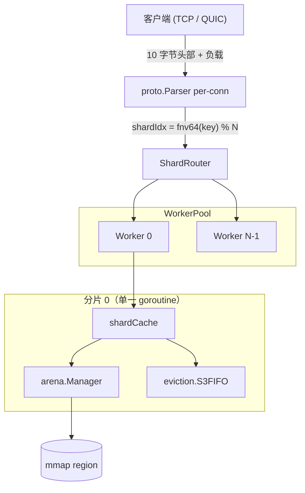

# Horreum 架构与设计规范 🏛️

[English](../architecture.md) | [Русский](../ru/architecture.md) | [中文](architecture.md)

---

## 1. 系统高级架构

Horreum 是一个无共享分片的内存键值缓存，支持可选的持久化、可选的认证加密和可选的值压缩。所有架构决策源于一个不变式：

> **热路径绝不能在 Go 堆上做分配。**

每个缓存值驻留在通过 `unsafe.Slice` 暴露给 Go 的 `mmap` 区域中。每个分片由恰好一个 goroutine（*分片 worker*）拥有。传输层将一个键的所有操作转发给拥有分片（即 `fnv64(key) mod NumShards` 命中的分片）的那个 goroutine。



### 1.1 原则

1. **零分配热路径** —— 无 GC 暂停
2. **无共享分片** —— Get/Set 无锁
3. **无锁原子频率计数器** —— S3-FIFO Touch 永不阻塞
4. **纯 mmap 存储** —— 值驻留在 Go 堆之外
5. **连接绑定路由** —— 可预测的每分片队列深度
6. **仅追加 WAL** —— 崩溃恢复是前向重放
7. **仅 stdlib**（除 quic-go）—— 静态二进制

---

## 2. 内存与 Arena 管理

### 2.1 为何使用 mmap？

当 Go 切片指向 mmap 的内存时，运行时不能追踪或重新安置它：`make([]byte, …)` 和 `append` 被禁止（可能触发 GC 扫描）；`copy(dst[off:off+n], src)` 是唯一允许的变更原语；`unsafe.Slice((*byte)(base), size)` 在 mmap 上零分配构造视图。

### 2.2 Region 布局

```
+---------------------------------------------------------------------+
| 超级块 (4 KiB)  |  Checkpoint (最多 regionSize/8, 最大 1 MiB)     |  保留前缀
+---------------------------------------------------------------------+
| 对象 0（8 字节对齐） | 对象 1 | 对象 2 | ... | 空闲区域       |  用户分配
+---------------------------------------------------------------------+
```

匿名 arena（NewManager）跳过预留。文件支持 arena（OpenFileManager）通过 `allocator.Skip(n)` 预留。

### 2.3 Handle —— 12 字节无指针引用

```go
type Handle struct {
    Offset uint32
    Size   uint32
    Meta   uint16
    Region uint8
    _      [1]byte
}
```

因为 Handle 不含指针，所以对 GC 不可见。

### 2.4 Meta 位

bits 0-1: freq (0..3); bits 2-3: 队列标签 (0=none, 1=S, 2=M); bit 4: compressed (LZ4); bit 5: encrypted (AES-256-GCM)。

### 2.5 Bump + 分离 freelist

12 个大小类（8, 16, 32, ..., 8192, >8192 仅 bump）。bump 通过 CAS。freelist 弹出/压入在互斥锁下。

### 2.6 多 Region 管理器

`regions atomic.Pointer[[]*region]`（不可变快照），`current *region` + `currentIdx` 是快路径。`mu` 仅在 newRegion 和 Close 上持有。

---

## 3. 协议

### 3.1 帧格式

```
+-+-+-+-+-+-+-+-+-+-+-+-+-+-+-+-+-+-+-+-+-+-+-+-+-+-+-+-+-+-+-+-+
| Magic (0x4848) | OpCode (1B) | Flags (1B)  |
+-+-+-+-+-+-+-+-+-+-+-+-+-+-+-+-+-+-+-+-+-+-+-+-+-+-+-+-+-+-+-+-+
| KeyLength (2 LE) | ValueLength (4 LE)       |
+-+-+-+-+-+-+-+-+-+-+-+-+-+-+-+-+-+-+-+-+-+-+-+-+-+-+-+-+-+-+-+-+
| ... Key ...   | ... Value ...              |
+-+-+-+-+-+-+-+-+-+-+-+-+-+-+-+-+-+-+-+-+-+-+-+-+-+-+-+-+-+-+-+-+
```

10 字节小端头部，最大 64 MiB。Magic `0x4848` 拒绝外部流量。Frame.Key/Value 是输入缓冲区的零拷贝视图。

### 3.2 操作码表

| 代码 | 名称 | 备注 |
|------|------|------|
| 0x01 | GET | 仅键 |
| 0x02 | SET | 键+值 |
| 0x03 | DEL | 仅键 |
| 0x04 | SETEX | 键 + `[ttl:4][value]` |
| 0x05 | CAS | 键 + `[expLen:4][期望][新值]` |
| 0x06 | INCR | 键 + `[delta:8]` |
| 0x07 | SCAN | 键（前缀） + `[cursor:8][count:4]` |
| 0x08 | DELPREFIX | 键（前缀） |
| 0x09-0x0C | HSET/HGET/HDEL/HGETALL | hash 操作 |
| 0x0D-0x11 | LPUSH/LPOP/RPUSH/RPOP/LLEN | list 操作 |
| 0x12-0x15 | SADD/SREM/SISMEMBER/SMEMBERS | set 操作 |

响应的 flags=0 表示 OK，flags=1 表示 ERROR。

### 3.3 流式解析器

`Parser.Feed(buf)` 将 buf 追加到 pending 字节中并提取完整帧。不完整字节保留到下一次调用。

---

## 4. 传输层

### 4.1 分片 Worker（无共享）

```
WorkerPool.Submit(job, shardIdx) → worker[shardIdx].queue ← job
```

worker 串行清空其队列；每个 shardCache 恰好被一个 goroutine 访问。

### 4.2 路由策略

- 单键操作：`fnv64(key) % NumShards`
- TCP pin：`fnv64(remoteAddr) % NumShards`
- SCAN / DELPREFIX：遍历所有分片

### 4.3 TCP / QUIC

- TCP：accept 循环，每连接一个 proto.Parser，dispatch 通过 WorkerPool
- QUIC：quic-go，证书通过 `quic.RegisterCertificate`

---

## 5. 数据处理流水线

```
value → compress (lz4) → encrypt (aes-256-gcm) → arena.Put
                                                       ↓
                                                    eviction (S3-FIFO)
```

Compress-then-encrypt——不变式。Handle.Meta 同时携带两个标志。

S3-FIFO: S (10%), M (90%), Ghost (= M)。Touch 无锁；Add/Delete 在 mu 下。

---

## 6. 持久化（internal/arena/persist）

### 6.1 磁盘布局

```
/var/lib/horreum/
├── arena.dat          ← MAP_SHARED
└── wal.log            ← append-only WAL
```

### 6.2 超级块 (v1, 56 字节)

magic `"HORREUM\0"` | version | regionSize | indexOffset=4096 | indexLen | walOffset | flags | checkpointCount。

### 6.3 WAL

SET/SETEX 头部 20/24 字节；DEL 12 字节。Magic `"WAL\0"`。

### 6.4 冷启动

1. open arena.dat (mmap MAP_SHARED)
2. open wal.log + repairTail
3. 加载 checkpoint（如果有）
4. replay WAL → idx.Put/idx.Delete
5. 同步 liveObjs

### 6.5 Checkpoint

snap → encode → arena copy → sync → superblock update → sync → wal.Rotate。

### 6.6 后台同步

time.Ticker 每秒 SyncAsync (MS_ASYNC)。

---

## 7. 配置（internal/config）

YAML + CLI。Bi/decimal units (MiB/MB)。Go-duration 格式 (`30s`)。

```yaml
server:
  addr: ":7373"
  transport: "tcp"
  shards: 4
  region_size: "256MiB"
  evict_capacity: 4096
storage:
  persistent_path: ""
  durable: true
metrics:
  addr: ":9090"
compression:
  algorithm: "none"
  min_size: 64
security:
  encryption_key_path: ""
```

Bootstrap 顺序：YAML → 标志 → logger → compressor/cipher → metrics → storage → HTTP → transport → wait → shutdown。

---

## 8. 可观测性

### 8.1 Prometheus 指标 (/metrics)

```
horreum_set_observations_total{status="ok|err"}
horreum_set_latency_seconds_bucket{le="..."}
horreum_memory_used_bytes / free_bytes
horreum_index_keys_total
horreum_evictions_total{queue="S|M"}
```

### 8.2 健康检查和日志

GET /healthz → 200 OK。slog，slow WAL sync → WARN。

---

## 9. 性能预算

| 操作 | p99 |
|------|-----|
| GET (plain, ~4 KiB) | ~600 ns |
| SET (plain, ~4 KiB) | ~1.2 µs |
| SET (compressed+encrypted) | ~6 µs |
| TOUCH (S3-FIFO) | ~50 ns |

---

## 10. 失败模式与恢复

| 失败 | 检测 | 恢复 |
|------|------|------|
| Put 进行中进程崩溃 | WAL fsync 丢失 | 冷启动 → checkpoint → replay |
| 超级块损坏 | 错误 magic/版本 | 视为新 arena → 完整 WAL replay |
| checkpoint 中途损坏 | ErrCheckpointBadMagic | 完整 WAL replay |
| 部分 WAL 记录 | repairTail 走过 | 截断到最后完整记录 |
| OOM | ErrArenaFull | API 错误 |
| 错误 AES 密钥 | decryption failed | API 错误 |

---

## 11. 扩展点

| 想添加… | 在哪里查看 |
|--------|------------|
| 新操作码 | internal/proto/proto.go + internal/transport/handler.go + api.CacheService |
| 新压缩器 | 实现 compress.Compressor (4 个方法) |
| 新密码器 | 实现 encrypt.Cipher (3 个方法) |
| 新淘汰策略 | 替换 internal/eviction；保持 Touch 无锁 |
| checkpoint 格式 | internal/arena/persist/checkpoint.go |
| 新传输 | 实现 api.Transport 工厂 |
